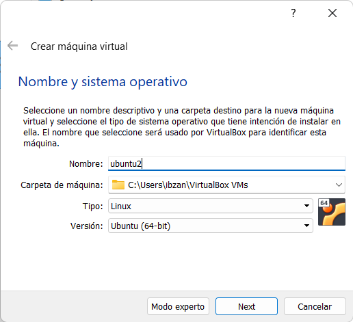
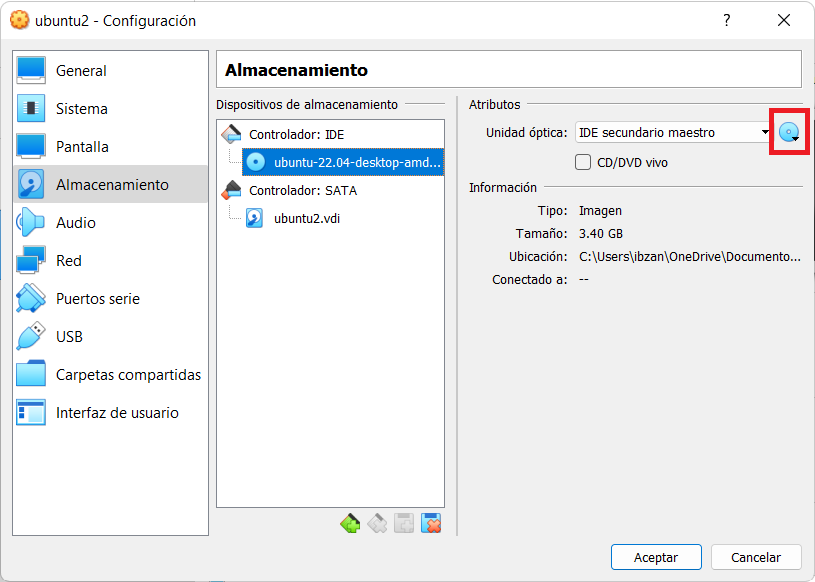

# Proyecto Final

## Creación

Para este proyecto, decidimos utilizar `docker`, ya que es es una tecnología que
nos permite crear contenedores con todo lo que necesitamos para la creación
del proyecto de manera sencilla, además de ser una tecnología ampliamente
utilizada.

### Instalación de docker (VM)

Para poder utilizar docker, la mayoría de los integrantes tuvieron que crear
una máquina virtual, ya sea ubuntu o basada en ubuntu, los pasos para
crear la maquina virtual fueron:

1. Utilizamos como software "VirtualBox" de Oracle; una vez ingresados a este damos click en "Nueva" para crear una nueva máquina virtual.


2. Nombramos a nuestra máquina virtual, seleccionamos la ubicación y el tipo de sistema operativo con el que la máquina va a funcionar.



3. Seleccionamos el tamaño de la memoria RAM (recomendamos asignarle como mínimo 2500 MB).


4. Seleccionamos la opción "Crear un disco duro virtual ahora".


5. Seleccionamos la opción "VDI (VirtualBox Disk Image).


6. Seleccionamos el almacenamiento de disco duro como "Reservado dinámicamente".


7. Y seleccionamos el tamaño del mismo.


8. Posteriormente damos click en "Configuración".


9. En primer lugar, seleccionamos el apartado de "Sistema" y en la pestaña "Procesador" seleccionamos 4CPUs (se recomienda tener la mitad de lo que se tiene en cada computadora).


10. En el apartado de "Pantalla" asignamos 128 MB a la memoría de video.


11. En el apartado de "Almacenamiento" en el disco marcado seleccionamos la imagen del sistema operativo que se desea. En este caso se seleccionó Ubuntu.



12. En el apartado de "Red" marcamos la opción "Habilitar adaptador de red" conectado a "Adaptador Puente".


13. Damos click en "Iniciar".


14. Seleccionamos el idioma de preferencia y damos click en la opción "Instalar Ubuntu".


15. Seleccionamos la distribución de teclado de preferencia.


16. Seleccionamos "Instalación mínima" y marcamos las dos opciones de la parte de abajo. (En este caso con la instalación mínima nos fue suficiente, pero si se desea se puede seleccionar la instalación normal).


17. En el tipo de instalación seleccionamos la opción "Borrar disco e instalar Ubuntu".


18. Damos en la opción continuar, ya que aquí nos muestra un mensaje de las particiones que se realizarán en el disco duro.


19. Seleccionamos el país o región en donde nos encontramos.


20. Aquí personalizamos la nueva computadora asignando las credenciales necesarias.


Y listo, esperamos a que termine de instalar Ubuntu.


### Instalación de docker

Para poder utilizar docker, es necesario instalar los paquetes `docker.io`
y `docker-compose`, en ubuntu, los comandos necesarios para instalar
estos paquetes son:

```bash
sudo apt-get update && sudo apt-get upgrade
sudo apt-get install docker.io
sudo apt-get install docker-compose
```

Para el usuario nativo de Arch linux, los comandos necesarios son:

```bash
sudo pacman -Syu
sudo pacman -S docker
sudo pacman -S docker-compose
```

En ambos casos, es necesario habilitar el servicio de docker después de instalarlo,
el comando es el mismo para ambas distribuciones.

```bash
sudo systemctl enable docker.service
```

### Especificación del archivo docker-compose.yaml

Docker por si mismo es muy útil, pero gestionar contenedores puede ser
bastante problemático, por lo que utilizamos `docker-compose` para
poder manejar los contenedores del proyecto.

Para el proyecto, utilizamos los contenedores:

- nginx:latest
- tomsik68/xampp
- mysql:latest

MySql y xampp fueron seleccionados porque la mayoría del equipo ya tenia un proyecto
que hicimos en otra materia que nos permitió reutilizar código. La mayoría de la
configuración fue tomada directamente de la documentación en la página de docker-hub
de cada contenedor.

```yaml
networks:
  proyecto-aaron:
    driver: bridge
    ipam:
      driver: default
      config:
        - subnet: "172.20.0.1/24"
```

Para permitir una fácil comunicación entre los contenedores, es necesario que
estén todos en la misma red de docker, el código que se puede ver arriba es
el código que se encarga de crear una red de docker para los contenedores.

```yaml
  nginx:
    image: nginx:latest
    volumes:
      - ./default.conf:/etc/nginx/conf.d/default.conf
    ports:
      - "80:80"
    environment:
      - NGINX_HOST=quipo-maravilla.com
      - NGINX_PORT=80
    networks:
      proyecto-aaron:
        ipv4_address: 172.20.0.2
```

Este es el contenedor de nginx, subimos nuestro propio archivo de configuración
`default.conf` que se encarga de re direccionar las llamadas a xampp,
exponemos el puerto 80 para poder comunicarnos con el desde la máquina host,
y le asignamos la ip `172.20.0.2`

```yaml
  xampp:
    image: tomsik68/xampp
    volumes:
      - ./crud:/opt/lampp/htdocs
    environment:
      TZ: UTC
    networks:
      proyecto-aaron:
        ipv4_address: 172.20.0.3
```

Esta es la especificación del contenedor de xampp, se monta la carpeta crud,
que contiene los archivos del proyecto, a la carpeta `/opt/lampp/htdocs`, la cual
nos da acceso a las rutas establecidas en el código fuente. No se expone ningun puerto,
no solo porque no es necesario ya que todos los contenedores de docker en una misma
red tienen acceso a si mismos, si no que exponer puertos causa problemas
como impedir que el contenedor de nginx inicie o permitirnos saltarnos pasar por
nginx y conectarnos directo a xampp. Se le asigna la ip `172.20.0.3`.

```yaml
  db:
    image: mysql:latest
    volumes:
      - "./mysql/data:/var/lib/mysql"
      - "./start.sql:/docker-entrypoint-initdb.d/setup.sql"
    environment:
      TZ: UTC
      MYSQL_ROOT_PASSWORD: r00t_p4ssw0rd
      MYSQL_DATABASE: db
      MYSQL_ROOT_HOST: '%'
    networks:
      proyecto-aaron:
        ipv4_address: 172.20.0.4

```

Esta es la especificación del contenedor de la base de datos, monta dos volumenes,
el primero es la carpeta en la que MySql guardará nuestros datos, el archivo
`start.sql`, es un script que el contenedor ejecuta automáticamente al crear el volumen
de mysql, no se expone ningún puerto, se le asigna la ip `172.20.0.4`. Cabe mencionar
que el script para crear la base de datos *solo se ejecuta al crear el volumen de
mysql*, si se quiere probar el funcionamiento del script, es necesario
borrar el volumen con `sudo rm -rf mysql`.


### Script de mysql

```mysql
use db;

CREATE TABLE IF NOT EXISTS usuarios
(    id     INTEGER NOT NULL PRIMARY KEY AUTO_INCREMENT,
    `username` VARCHAR(255) NOT NULL,
    `nombre` VARCHAR(60) NOT NULL,
    `ap_paterno` VARCHAR(60) NOT NULL,
    `ap_materno` VARCHAR(60) NOT NULL
);

INSERT INTO usuarios (username, nombre, ap_paterno, ap_materno) 
VALUES ('ProfeAaron', 'Aaron', 'Velasco', 'Agustin');
```

Para este ejercicio, creamos una simple tabla con un nombre de usuario,
nombre, y apellidos, e insertamos un valor de inicio para probar su
funcionamiento.

### Configuración nginx

Para la configuración de nginx, solo es necesario hacer un pequeño cambio
al archivo que viene por defecto en el contenedor

```verbatim
    location ~ ^/(.*)$ {
      proxy_pass http://172.20.0.3/api/2022-2/src/public/$1;
    }
```

Esta linea manda todas las llamadas que hagamos a nginx
a nuestra contenedor de xampp, a la ruta `/api/2022-2/src/public`,
que es donde se encuentra nuestra api

### API

Esta es la estructura del proyecto de xampp


En la carpeta public se encuentra el archivo `index.php`, que es el
que se encarga de ejecutar las llamadas a la API CRUD, la carpeta
vendor tiene varias librerias necesarias para nuestro proyecto,
el archivo `config.php` contiene la información necesaria para
conectarse a la base de datos, y el archivo `fucniones.php` contiene
funciones de ayuda para el proyecto.

### Iniciar el contenedor

Para poder iniciar el contenedor, solo es necesario correr el comando
`sudo docker-compose up -d` en la carpeta donde se encuentra el archivo
`docker-compose.yaml`


### Utilizando git

Como github eliminó la habilidad de empujar cambios al repositorio
usando solo el usuario y la contraseña, fue necesario que todos
nos creáramos llaves ssh para poder subir nuestros cambios.

Para crear un par de llaves ssh, es necesario correr el comando
`ssh-keygen` y seguir las instrucciones en pantalla, después de eso,
hay que obtener el contenido del archivo con la terminación `.pub`


Una vez hecho esto, es necesario ir a `github.com`, iniciar sesión,
ir a tu configuración y a llaves SSH y GPG, y añadir nueva llave,
aquí copiamos el contenido del archivo `.pub`.


### Subiendo cambios

Para crear la rama con nuestro nombre, solo es necesario correr el
comando `git checkout -b <nombre>`, para cambiar entre ramas,
se corre el mismo comando, pero sin la bandera `-b`


Si hay cambios que no tenemos localmente, es necesario correr el
comando `git pull`, para obtener los cambios específicos de una
rama, se corre el comando `git pull origin <rama>`.

Después de obtener los cambios locales, se realizan los cambios
que queramos hacer, una vez terminado, se usa el comando
`git add` para añadir los archivos que queremos actualizar.
Después se corre el comando `git commit -m "mensaje"` para crear
un commit. Este proceso se puede repetir varias veces de manera local,
una vez estemos listos para subir nuestros cambios al repositorio,
se utiliza el comando `git push origin <rama>`


### Probando la API

Originalmente, nuestra intención era probar la API utilizando postman,
pero problemas de configuración específicos de postman lo impidieron,
despues intentamos con firefox, y encontramos problemas similares,
por lo cual recurrimos a CURL

Comandos utilizados para las pruebas:

```bash
curl -i -k -X POST -H 'Content-Type: application/json' -d '{
    "username": "Pao", 
    "nombre": "Paola", 
    "ap_paterno": "Magañá", 
    "ap_materno": "Alvarez"
  }' http://localhost/registro
```


```bash
curl -i -k -X GET http://localhost/get
```


```bash
curl -i -k -X GET http://localhost/alumnos\?nombre=Paola
```


```bash
curl -i -k -X PUT -H 'Content-Type: application/json' -d '{
    "username": "Prueba", 
    "nombre": "Paola", 
    "ap_paterno": "Magaña", 
    "ap_materno": "Alvarez"
  }' http://localhost/alumnos/4
```


```bash
curl -i -k -X DELETE http://localhost/delete/4
```


### Integridad del proyecto

En primer lugar comprimimos el proyecto con el comando: ```tar -zcvf ProyectoFinalOACC.tar.gz ProyectoFinalOACC/```
